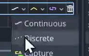

# Godot4.0 资源收集RPG游戏

> 视频地址：b站-BV1sk4y1L7BP 原介绍：
>
> 图片素材：https://chris-tutorials.itch.io/gatherers-exterior-pack
>
> 学习如何在Godot 4引擎中编码和设计一个资源收集游戏。
>
> 我们将涵盖许多主题，包括玩家角色设置、热键、装备物品、带有HUD显示的库存、粒子效果以及用于定义游戏内物品的资源文件。

1. 俯视角类似浮岛物语风格的游戏，但目前不包含怪物。
2. 作者实现了换装动画效果，即人物行走图为空手帧动画，将武器图片用2D变化结合动画关键帧放在手上。
3. 实现了工具-资源碰撞检测

## 第一集：实现角色场景

1. 创建玩家场景
2. 建立角色的干活动画，实现干活动画的工具换装效果和碰撞区域：

    1. 角色Sprite2D的frame、hframe和texture属性
    2. 通过调整玩家场景EquipSprite的scale、position、rotation来实现工具图片握在人物手中，动画关键帧中还可以修改`Z Index`
       ，让工具显示在角色前面还是后面。修改texture就相当于换别的工具
    3. 同时也可以通过动画节点来设定碰撞箱与斧头位置贴合
       > 在动画帧每个轨道的右侧，可以选择线性变化还是离散变化
       > 
3. 设置wsad角色键位物理映射，并将其与方向向量direction关联，编写简单的移动代码

```python
Input.get_axis("ui_left", "ui_right")  # 2d横版常用该函数，按左键为-1，按右键为1
Input.get_vector("left", "right", "up", "down")  # 俯视角常用，返回一个二维向量，如左上返回(-1,1)
# 此外，还可以通过Vector2.normalized()对向量执行归一化操作（就是变成单位向量）
```

```python
# player.gd
extends
CharacterBody2D


@export


var
speed: float = 200.0

func
_physics_process(delta: float) -> void:
var
direction: Vector2 = Input.get_vector("left", "right", "up", "down").normalized()
if direction:
    velocity = direction * speed
else:
    velocity = Vector2.ZERO
move_and_slide()
```

4. 修改项目设置
   > 参见像素游戏设置，视口大小为288x162，窗口大小为1152x648
>
5. 启动游戏查看效果
