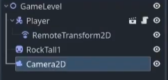
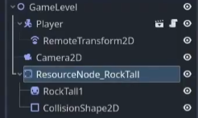
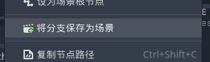
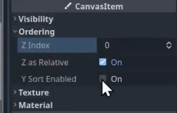

## 第二集：关卡场景与摄像机与Y-排序

> 开始在Godot中设置一个关卡场景。填充一些可碰撞的岩石物体，添加一个跟随摄像机，并启用Y-排序，使精灵以自上而下的2D游戏风格呈现。

Y-排序，指图片的y值越大的显示在越前面（即近在前，远在后），默认是深度优先遍历越晚（节点顺序越靠下）的越前面。

1. 创建2d场景后，如图添加所示节点，其中Player实例化自player.tscn文件生成的玩家场景（RockTall不用创建）

>  
> RemoteTransform2D的Transform2D属性继承自Player，再通过指定Remote
> Path属性，使其指向Camera2D，就能将自身的Transform2D属性传递给Camera2D，从而使得摄像机节点即使不是Player的子节点也可以与Player坐标保持一致

2. 添加如下节点，使用到了StaticBody2D节点

>  
> StaticBody2D`Godot内介绍：表示静止的物体，仅能通过脚本进行移动，通常作为墙或地板。`

3. 将岩石保存为场景，这通常称为PackedScene
>  
> 保存后原场景中的节点整个分支会变为实例化场景的形式存在。就是右侧会出现电影的图标，点击可以进入相应场景的编辑界面。 
> 原视频作者这里保存到了`res://Objects/Resources/resource_node_rock_tall.tscn`

4. 使用`Ctrl+D`快捷多复制几个岩石实例，并使用`w`键移动到合适的位置
5. 设置关卡场景根节点为`Y-排序`：
>  
> `Y Sort Enabled` -> on 
> 会将该节点下所有的Sprite2D节点按照Y-排序顺序渲染

6. 