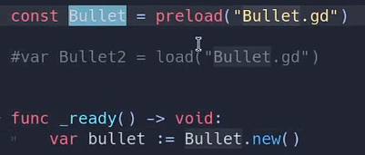
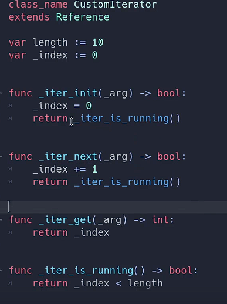

# 待整理

* [ ]  top5技巧
* [ ]

1. 你不需要集中处理
2. 不要通过JSON保存游戏，而是使用var\_to\_str()和str\_to\_var()配合字典完成属性的注入
3. 使用preload()而不是load()
4. 使用各种类型的值作为字典的键（其实就是提倡多用字典）
5. 使用迭代，创建自定义迭代器

1.当创建的节点十分多时，往往会考虑建立一个对象池来重复的使用池中的对象，从而减少卡顿。但是实际上godot创建对象花费的成本很小，因此大多数情况下你无需考虑建立对象池，因为对象池也会使得代码复杂许多。

2.有一种比JSON容易的多的方式来保存游戏，那就是var\_to\_str()和str\_to\_var()，而JSON作为JavaScript中技术，它对游戏引擎的支持并不好，如坐标，浮点数等，因此往往需要专门对数据进行转换才能使用。而var\_to\_str()和str\_to\_var()可以直接使用，直接用字典获取数据，由于str\_to\_var()会返回一个Variant类型，因此可以通过赋值等强制类型转换的方式注入给相应节点或对象。

ps：但是JSON在网络数据传输，配置项，本地化还是有很大用武之地的。

3.preload()和load()都可以用来加载文件资源，但是前者相比于后者有许多优势。

* 在preload()中提供路径时，godot引擎会自动检查是否有对应文件，而load()不会。
* preload()可以赋值给常量const，而load()不能，这有利于团队合作。
* preload()在godot引擎打开这个场景时就能读取到，而load()则需要游戏运行到该行代码时才知道有加载这么一个文件。这意味着preload()可以配合进行对象的new操作。

4.其实就是提倡多用字典，视频中展示了将Vector2坐标作为key，从而轻易的管理网格位置。

5.熟悉并使用诸如get\_children(),get\_nodes\_in\_group()等返回数组的函数，并在必要时可以自己实现迭代器。视频中展示了一种典型的迭代器写法。

