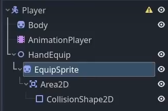

# Godot4 资源收集RPG游戏

> 原介绍：
>
> 图片素材：https://chris-tutorials.itch.io/gatherers-exterior-pack
>
> 学习如何在Godot 4引擎中编码和设计一个资源收集游戏。
>
> 我们将涵盖许多主题，包括玩家角色设置、热键、装备物品、带有HUD显示的库存、粒子效果以及用于定义游戏内物品的资源文件。

1. 俯视角类似浮岛物语风格的游戏，但目前不包含怪物。
2. 作者实现了换装动画效果，即人物行走图为空手帧动画，将武器图片用2D变化结合动画关键帧放在手上。
3. 实现了工具-资源碰撞检测

## 第一集：实现角色场景

1. 创建玩家场景
   > 
   >
2. 建立角色的干活动画，实现干活动画的工具换装效果和碰撞区域：
   1. 角色Sprite2D的frame、hframe和texture属性
   2. 通过调整玩家场景EquipSprite的scale、position、rotation来实现工具换装，修改texture就相当于换别的工具
   3. 同时也可以通过动画节点来设定碰撞箱与斧头位置贴合
      > 在动画帧每个轨道的右侧，可以选择线性变化还是离散变化
      > 
      >
3.
